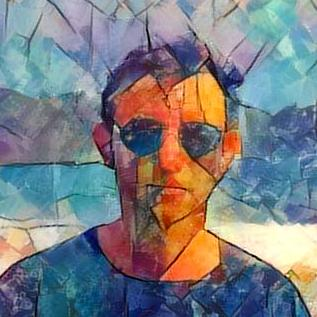

# Manuel Vargas
Profesor de la Escuela de Geografía de la [Universidad de Costa Rica](https://www.ucr.ac.cr/). Imparte cursos de programación en lenguajes como [R](https://www.r-project.org/), [Python](https://www.python.org/), SQL y JavaScript.

## Cursos impartidos
* [Procesamiento de datos geográficos](https://gf0604-procesamientodatosgeograficos.github.io/2024-i/)
* [Exploración y explotación de datos geográficos](https://gf0659-exploraciongeodatos.github.io/2023-ii/)
* [Programación de aplicaciones en SIG](https://pf0907-programacionsig.github.io/2023-ii/)

